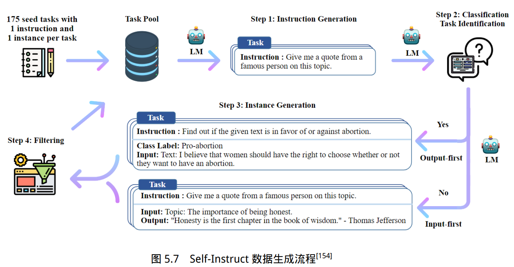

# 构建指令数据集

## 手动构建指令
高质量、多样性丰富的指令数据可以“以少胜多”。

**优点**：可以很好的把控指令数据的标注过程，并对整体质量进行很好的控制。

**缺点**：耗时耗力

## 自动构建指令
利用大模型的生成能力自动生成指令，如Self-Instruct。

### Self-Instruct的流程

1. **生成任务指令**：手动构建一个小型的指令数据集，作为种子数据集，然后从中采样8个指令作为例子让大模型生成指令。
2. **确定指令是否为分类任务**：让大模型确定生成的指令是否为分类任务，不同任务类型后续处理不同。
3. **生成任务的输入和输出**：让大模型生成指令的一个具体任务实例，包括输入和输出。对于非分类任务，使用输入优先方法，让大模型先生成输入，然后根据输入和指令生成输出；对于分类任务，为避免大模型过多产生某一类别的输入，可使用输出优先方法，让大模型先产生可能的输出类别，然后根据指令和输出补齐输入。
4. **过滤低质量数据**：包括放弃与已有数据相似度过高的数据、删除包含某些关键词的数据、放弃过长或过短的数据。

